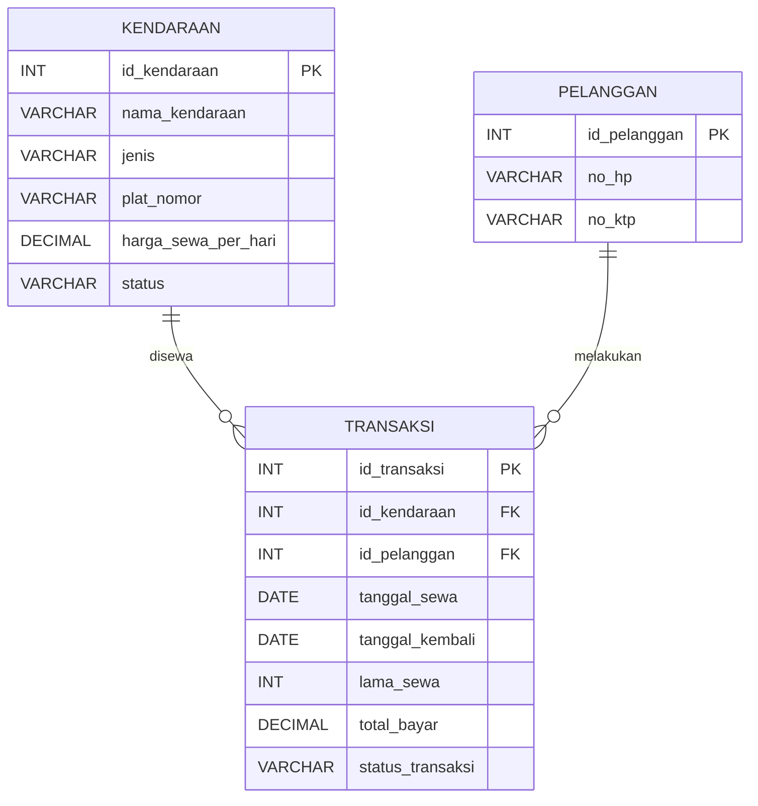

# Aplikasi Rental Kendaraan

## Identitas

- Nama: Frederico Sarren
- Kelas: XII RPL
- Sekolah: SMKS Tri Ratna
- Mata pelajaran: STS Kelas XII RPL
- Tema proyek: Pengelolaan rental kendaraan

## Ringkasan Proyek

Aplikasi ini membantu pengelola rental mencatat kendaraan, pelanggan, dan transaksi penyewaan. Pengguna dapat melihat daftar, mencari, mengurutkan, menambah, mengubah, dan menghapus data melalui halaman web.

**Pengguna:** pemilik atau petugas administrasi rental. Aplikasi belum memiliki login atau pembagian hak akses.

**Tujuan:** menyimpan data rental secara terstruktur, menghubungkan pelanggan dengan kendaraan yang disewa, dan memudahkan pencatatan tanggal, lama sewa, pembayaran, serta status transaksi.

## Fitur

- CRUD kendaraan dengan nama, jenis, plat nomor, harga sewa, dan status.
- CRUD pelanggan dengan nomor HP dan nomor KTP; ID dibuat oleh database.
- CRUD transaksi dengan ID kendaraan, ID pelanggan, tanggal sewa/kembali, lama sewa, total bayar, dan status.
- Pencarian dan pengurutan daftar pada setiap bagian.
- Pilihan kendaraan dan pelanggan pada form transaksi menggunakan ID yang tersimpan.
- Validasi field wajib dan validasi tanggal kembali agar tidak lebih awal dari tanggal sewa.
- Notifikasi jumlah data dan pesan berhasil/gagal.

**Catatan cakupan:** informasi lengkap ditampilkan pada tabel, tetapi belum ada halaman detail terpisah. Ringkasan saat ini berupa jumlah baris pada tiap halaman; belum ada laporan agregat, misalnya omzet atau jumlah transaksi per status.

## Teknologi

- Node.js dan Express untuk server dan REST API.
- MySQL untuk penyimpanan data.
- `mysql2` sebagai driver MySQL.
- HTML, CSS, dan JavaScript tanpa framework untuk antarmuka.

## Struktur Folder

```text
.
|-- index.html                 # Halaman navigasi utama
|-- style.css                  # Gaya bersama
|-- server.js                  # Server Express dan endpoint API
|-- database/
|   |-- schema.sql             # Struktur tabel
|   `-- seed.sql               # Contoh data
|-- kendaraan/
|   |-- index.html
|   `-- script.js
|-- pelanggan/
|   |-- index.html
|   `-- script.js
`-- transaksi/
    |-- index.html
    `-- script.js
```

## Database

Server memakai database `rental_kendaraan`. DDL kendaraan dan pelanggan dicocokkan dengan database lokal yang diperiksa; tabel transaksi mengikuti kolom yang diberikan. `database/schema.sql` membuat tabel yang belum ada tanpa mengubah tabel lama.

| Tabel | Kolom | Tipe yang disarankan | Aturan |
|---|---|---|---|
| `kendaraan` | `id_kendaraan` | `INT` | Primary key, auto increment |
| | `nama_kendaraan` | `VARCHAR(100)` | Wajib |
| | `jenis` | `VARCHAR(30)` | Wajib, contoh `Mobil` atau `Motor` |
| | `plat_nomor` | `VARCHAR(20)` | Wajib |
| | `harga_sewa_per_hari` | `DECIMAL(12,2)` | Wajib, lebih dari 0 |
| | `status` | `VARCHAR(20)` | Wajib; `Tersedia`, `Disewa`, atau `Maintenance` |
| `pelanggan` | `id_pelanggan` | `INT` | Primary key, auto increment |
| | `nama_pelanggan` | `VARCHAR(100)` | Wajib pada database saat ini |
| | `no_hp` | `VARCHAR(15)` | Wajib; simpan sebagai teks agar awalan angka tidak hilang |
| | `alamat` | `VARCHAR(255)` | Wajib pada database saat ini |
| | `no_ktp` | `VARCHAR(16)` | Wajib dan unik; simpan sebagai teks |
| `transaksi` | `id_transaksi` | `INT` | Primary key, auto increment |
| | `id_kendaraan` | `INT` | Foreign key ke `kendaraan.id_kendaraan` |
| | `id_pelanggan` | `INT` | Foreign key ke `pelanggan.id_pelanggan` |
| | `tanggal_sewa` | `DATE` | Wajib |
| | `tanggal_kembali` | `DATE` | Wajib; tidak boleh sebelum tanggal sewa |
| | `lama_sewa` | `INT` | Dihitung dari selisih tanggal dalam hari |
| | `total_bayar` | `DECIMAL(12,2)` | Wajib, tidak negatif |
| | `status_transaksi` | `VARCHAR(20)` | Wajib; contoh `Berlangsung` atau `Selesai` |

`id_transaksi`, `id_kendaraan`, dan `id_pelanggan` adalah primary key pada tabel masing-masing. Secara relasi, satu kendaraan dan satu pelanggan dapat muncul di banyak transaksi; setiap transaksi menunjuk satu kendaraan dan satu pelanggan. Pastikan kedua foreign key benar-benar dibuat di MySQL agar referensi yang tidak valid ditolak oleh database.



### Contoh Data Kendaraan

Lima baris berikut diambil dari API lokal pada 1 Oktober 2026. Ini contoh data yang sedang tersimpan, bukan data seed yang akan dimasukkan saat instalasi.

| ID | Nama | Jenis | Plat nomor | Harga/hari (Rp) | Status |
|---:|---|---|---|---:|---|
| 1 | Toyota Avanza | Mobil | B 1234 ABC | 300.000 | Tersedia |
| 2 | Honda Brio | Mobil | B 2345 ABD | 275.000 | Disewa |
| 3 | Daihatsu Xenia | Mobil | B 3456 ABE | 290.000 | Tersedia |
| 4 | Toyota Innova | Mobil | B 4567 ABF | 450.000 | Tersedia |
| 5 | Suzuki Ertiga | Mobil | B 5678 ABG | 320.000 | Tersedia |

### Alasan Relasi Tabel

Data kendaraan dan pelanggan dipisahkan agar data pokok tidak disalin berulang kali untuk setiap penyewaan. Tabel `transaksi` menyimpan dua ID sebagai foreign key serta tanggal, lama, pembayaran, dan status transaksi. Dengan demikian, riwayat transaksi tetap menunjuk record pelanggan dan kendaraan yang benar.

## Instalasi dan Menjalankan

Prasyarat: Node.js, npm, dan MySQL sudah terpasang. Jalankan schema dan seed secara manual; server tidak menjalankan SQL otomatis.

1. Jalankan `database/schema.sql` melalui MySQL Workbench atau terminal MySQL. File ini membuat tabel yang belum ada dan tidak mengubah definisi tabel yang sudah ada.
2. Untuk database baru saja, jalankan `database/seed.sql` untuk mengisi contoh data. Perintah `INSERT IGNORE` melewati ID yang sudah ada; seed tidak berjalan otomatis.
3. Periksa koneksi di `server.js`: host `localhost`, user `root`, password kosong, database `rental_kendaraan`. Sesuaikan dengan MySQL lokal.
4. Buka terminal pada folder proyek dan jalankan:

   ```powershell
   npm install
   npm start
   ```

5. Buka `http://localhost:3000` di browser.

Jika port 3000 sedang digunakan, hentikan proses server lama atau jalankan server pada port lain:

```powershell
$env:PORT=3001
npm start
```

Aplikasi tidak mempunyai akun uji karena belum ada fitur autentikasi. Jangan gunakan konfigurasi `root` tanpa password untuk server publik.

## Alur Utama

1. Petugas membuka bagian Kendaraan atau Pelanggan, lalu mencari/mengurutkan daftar atau menambah data melalui tombol `+`.
2. Saat membuat transaksi, petugas memilih ID pelanggan dan ID kendaraan, mengisi tanggal sewa/kembali, total bayar, dan status.
3. Aplikasi menghitung `lama_sewa` dari selisih tanggal dan mengirim transaksi ke API.
4. Express memvalidasi input, menjalankan query MySQL, lalu mengembalikan hasil.
5. Daftar dimuat ulang dan menampilkan data tersimpan atau pesan kesalahan.

## Kebutuhan Fungsional

1. Sistem menampilkan daftar kendaraan, pelanggan, dan transaksi.
2. Sistem menambahkan data baru untuk ketiga entitas.
3. Sistem mengubah data kendaraan, pelanggan, dan transaksi.
4. Sistem menghapus data dan meminta konfirmasi di antarmuka.
5. Sistem mencari kendaraan berdasarkan nama/plat, pelanggan berdasarkan ID/HP/KTP, dan transaksi berdasarkan kolom transaksinya.
6. Sistem mengurutkan daftar berdasarkan kolom yang dipilih dan arah naik/turun.
7. Sistem membuat transaksi yang menghubungkan ID kendaraan dan ID pelanggan.
8. Sistem menghitung lama sewa dari tanggal sewa dan tanggal kembali.
9. Sistem menolak field wajib yang kosong serta tanggal kembali sebelum tanggal sewa.
10. Sistem menampilkan jumlah data dan pesan hasil operasi.

## Analisis Tertulis

### 18. Masalah dan Pengguna

Pencatatan rental secara terpisah dapat menyulitkan petugas saat mencari kendaraan, data pelanggan, dan riwayat penyewaan. Aplikasi ditujukan kepada pemilik atau petugas administrasi rental.

### 19. Tujuan Utama

Menyediakan satu aplikasi untuk mengelola kendaraan, pelanggan, dan transaksi rental dalam database yang saling berhubungan.

### 20. Data yang Disimpan

Data kendaraan (ID, nama, jenis, plat, harga, status), pelanggan (ID, nomor HP, nomor KTP), serta transaksi (ID transaksi, ID kendaraan, ID pelanggan, tanggal sewa/kembali, lama sewa, total bayar, status).

### 21. Kebutuhan Fungsional

Kebutuhan utama: daftar dan pencarian data, tambah/ubah/hapus kendaraan dan pelanggan, tambah/ubah/hapus transaksi, pengurutan tabel, validasi input, dan notifikasi hasil operasi.

### 22. Alur dari Input ke Penyimpanan

Form mengirim JSON ke endpoint Express dengan metode `POST` atau `PUT`. Server memeriksa field wajib dan rentang tanggal, menghitung lama sewa, lalu menjalankan query MySQL berparameter. Jika query berhasil, UI memuat ulang daftar; jika gagal, UI menampilkan pesan API.

### 23. Alasan Tabel dan Hubungan

`kendaraan` dan `pelanggan` menyimpan data induk. `transaksi` menjadi tabel penghubung karena satu transaksi wajib merujuk satu record kendaraan dan satu record pelanggan. Foreign key mencegah transaksi menunjuk ID yang tidak tersedia.

### 24. Contoh CRUD, Transaksi, Validasi, dan Kendala

- **CRUD:** endpoint `PUT /api/pelanggan/:id` mengubah `no_hp` dan `no_ktp` berdasarkan `id_pelanggan`; endpoint kendaraan dan transaksi memiliki pola CRUD serupa.
- **Transaksi/query:** `POST /api/transaksi` menyimpan ID kendaraan/pelanggan, tanggal, lama sewa, total bayar, dan status dalam satu record transaksi.
- **Validasi:** API menolak field transaksi wajib yang kosong dan menolak `tanggal_kembali` sebelum `tanggal_sewa`.
- **Kendala/perbaikan:** transaksi sudah memakai `total_bayar` dan `lama_sewa`. Tabel transaksi ternyata belum ada pada database; `database/schema.sql` menambahkannya. Proses lama pada port 3000 masih memberi 404, tetapi source terbaru pada port 3001 merespons route dan validasi dengan benar.
- **Kendala pelanggan:** database aktif mewajibkan `nama_pelanggan` dan `alamat`, sedangkan form/API hanya mengirim `no_hp` dan `no_ktp`. Form/API pelanggan masih perlu diselaraskan sebelum create pelanggan valid dapat dinyatakan lulus.

### 25. Penggunaan AI dan Referensi

GitHub Copilot digunakan untuk membantu menyusun dan meninjau kode serta dokumentasi. Hasilnya diperiksa terhadap nama kolom dan endpoint proyek, syntax check, serta respons GET dari API lokal. Pengujian tulis ke database tidak dilakukan untuk menghindari perubahan data yang sudah ada.

Referensi teknis:

- [Dokumentasi Node.js](https://nodejs.org/docs/latest/api/)
- [Dokumentasi Express](https://expressjs.com/)
- [Dokumentasi MySQL2](https://sidorares.github.io/node-mysql2/)

## Pengujian

Pengujian API dilakukan pada `http://localhost:3001` tanggal 1 Oktober 2026 menggunakan source terbaru. Bukti yang tersedia berupa output PowerShell; screenshot tidak disertakan. Permintaan POST dalam tabel adalah input tidak valid sehingga tidak menambah record. Seed belum dijalankan.

| No. | Skenario / langkah | Hasil yang diharapkan | Hasil aktual | Status / bukti |
|---:|---|---|---|---|
| 1 | GET `/api/kendaraan` | HTTP 200 dan daftar tampil | HTTP 200, 13 kendaraan | Lulus; output PowerShell |
| 2 | GET `/api/pelanggan` | HTTP 200 dan daftar tampil | HTTP 200, 6 pelanggan | Lulus; output PowerShell |
| 3 | GET `/api/transaksi` | HTTP 200 dan daftar tampil | HTTP 200, 0 transaksi pada tabel baru | Lulus; output PowerShell |
| 4 | POST `/api/kendaraan` dengan `{}` | HTTP 400 karena field wajib kosong | HTTP 400 | Lulus; output PowerShell |
| 5 | POST `/api/pelanggan` dengan `{}` | HTTP 400 karena HP/KTP kosong | HTTP 400 | Lulus; output PowerShell |
| 6 | POST `/api/transaksi` dengan `{}` | HTTP 400 karena field wajib kosong | HTTP 400 | Lulus; output PowerShell, port 3001 |
| 7 | POST transaksi dengan tanggal kembali sebelum tanggal sewa | HTTP 400 | HTTP 400 | Lulus; output PowerShell, port 3001 |
| 8 | Tambah, ubah, dan hapus data valid | Record tersimpan/berubah/terhapus dan daftar diperbarui | Belum dijalankan agar data database pengguna tidak berubah | Belum diuji; gunakan database uji |

**Kriteria lanjut:** hentikan proses lama pada port 3000, jalankan ulang server, lalu uji transaksi valid dan CRUD pada database uji. Jangan jalankan pengujian hapus pada database berisi data penting.

## Kendala dan Batasan Saat Ini

- Koneksi MySQL ditulis langsung di `server.js`; ubah sesuai lingkungan lokal dan jangan publikasikan kredensial.
- Schema dan seed tersedia, tetapi harus dijalankan manual; seed belum dijalankan. Tidak ada akun login.
- Ringkasan hanya menunjukkan jumlah baris; laporan omzet atau rekap per status belum tersedia.
- Belum ada halaman detail terpisah.
- Validasi transaction route sudah lolos pada source terbaru di port 3001. POST valid belum diuji agar tidak menulis ke database pengguna.
- Customer create belum cocok dengan kolom wajib `nama_pelanggan` dan `alamat` yang ditemukan pada database aktif.
